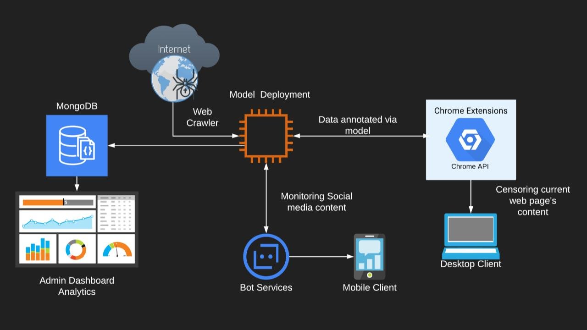

# NoMoreCyberBullying

<div align='center'>
    
</div>

<div align='center'>
[](https://pypi.org/project/Flask/)
[](https://www.python.org/)
</div>

NoMoreCyberBullying a comprehensive platform designed to combat cyberbullying and promote a safer online environment. Built with Flask and Python, this project aims to identify and report inappropriate content across various social media platforms, empowering users and authorities to take action against cyberbullying.

## Key Features

- **Automated Content Monitoring**: Deploy bots (crawlers) on platforms like Twitter, Facebook, Reddit, and more to identify and report inappropriate posts, comments, images, and videos. Leverage advanced machine learning models, including an "attention-based" transformer for text and a "CNN-LSTM" model for multimedia content.

- **Admin Dashboard**: Access an intuitive admin dashboard with in-depth analytics and notifications about reported cyberbullying incidents. Stay informed about case statuses and victim support.

- **Automated Reporting**: Easily generate and send comprehensive reports to relevant authorities, facilitating swift action against cyberbullying activities.

- **Browser Extension**: Enhance your browsing experience with a Chrome extension that hides bullying content for victims and highlights it for administrators. It also monitors WhatsApp conversations, disabling the send button for inappropriate messages.

- **Chat Bot Integration**: Leverage a Telegram bot to automatically kick out misbehaving members from groups after issuing warnings, fostering a safer and more respectful online community.

## Getting Started

```bash
# Get the code
git clone https://github.com/mihir2510/BulliesEye.git
cd BulliesEye/WebApp

# Set up a virtual environment (Unix-based systems)
virtualenv --no-site-packages env
source env/bin/activate

# Install required packages
pip3 install -r requirements.txt

# Set the FLASK_APP environment variable
export FLASK_APP=run.py

# Enable debug mode (for development)
export FLASK_ENV=development

# Start the application
flask run --host=0.0.0.0 --port=5000

# Access the dashboard in your browser: http://127.0.0.1:5000/
```

For the auto-report generation feature to work, update the sender's email and password in [routes.py](WebApp/app/home/routes.py). Additionally, update the SQL engine path in the same file.

### Model Details

- Custom word embeddings trained using the `word2vec` algorithm on the "hatespeech" dataset from Kaggle.
- Model architecture includes an Embedding layer, SpatialDropout, BiDirectional LSTM, Conv1D, GlobalAveragePooling, and Dense layers.
- Achieved ~97% accuracy after training for 5 epochs.

### Scraper Details

- Utilizes [Tweepy](https://www.tweepy.org/) for scraping tweets from Twitter, which are then passed through the model to check for abusive content.
- Top X most offensive tweets are displayed on the admin's dashboard, with an option to auto-generate reports for each offensive/cyberbullying tweet and mail them to relevant authorities.
- Admins can also search for tweets containing specific offensive words.

### Extension Details

- **Webapp Cyberbully Detector Extension**: Hides (for victims) and highlights (for admins) bullying content, including text and images, on any web page. It can highlight and redact text, as well as hide images. The Chrome extension can be found [here](https://github.com/mihir2510/BulliesEye/tree/master/Extensions/Web-Cyberbully-Detector).

- **WhatsApp Cyberbully Detector Extension**: Keeps track of WhatsApp conversations and disables the send message button with a warning if the user tries to send an inappropriate comment. The Chrome extension can be found [here](https://github.com/mihir2510/BulliesEye/tree/master/Extensions/WhatsApp-Cyberbully-Detector).

### Telegram Bot

- A Telegram bot that kicks out misbehaving members from groups after issuing three warnings.
- Trained on a custom model for detecting inappropriate text and utilizes the [Content Moderation API](https://app.nanonets.com/content-moderation-api/) for NSFW image detection.

### Use Case

<div align='center'>
    
</div>

- Data "crawled" from social media websites and the internet is stored in a database.
- The model classifies these threads/comments as toxic or non-toxic.
- The results, along with additional features like analytics, topic modeling, and report facilities, are displayed in the Web UI.
- The Chrome extension accesses the current web page's content, sends it to the background script for classification by the model, and displays the filtered content back on the page, preventing the display of explicit content.

### TODO

- [ ] Target additional platforms like Reddit and Facebook (currently deployed as a Twitter and Telegram Bot)


#### Dashboard Credits

[Flask Dashboard AdminLTE](https://appseed.us/admin-dashboards/flask-dashboard-adminlte) - provided by **AppSeed**

#### Disclaimer

> The texts and images used in this app were for testing purposes only. We do not encourage anyone to use it for criminal activities or cyberbullying.